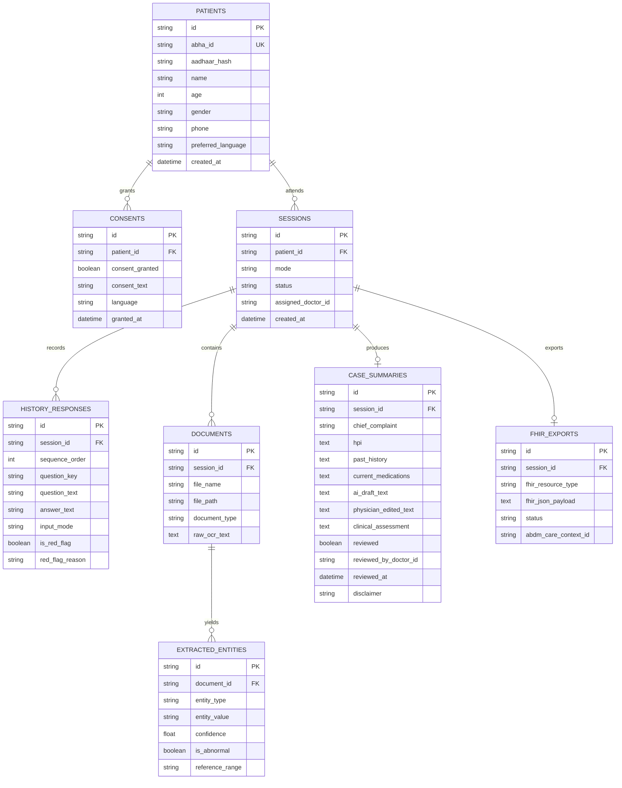

# MediKiosk Database Entity-Relationship Diagram

```mermaid
erDiagram
    PATIENTS ||--o{ CONSENTS : grants
    PATIENTS ||--o{ SESSIONS : attends
    SESSIONS ||--o{ HISTORY_RESPONSES : records
    SESSIONS ||--o{ DOCUMENTS : contains
    DOCUMENTS ||--o{ EXTRACTED_ENTITIES : yields
    SESSIONS ||--o| CASE_SUMMARIES : produces
    SESSIONS ||--o| FHIR_EXPORTS : exports

    PATIENTS {
        string id PK
        string abha_id UK
        string aadhaar_hash
        string name
        int age
        string gender
        string phone
        string preferred_language
        datetime created_at
    }

    CONSENTS {
        string id PK
        string patient_id FK
        boolean consent_granted
        string consent_text
        string language
        datetime granted_at
    }

    SESSIONS {
        string id PK
        string patient_id FK
        string mode
        string status
        string assigned_doctor_id
        datetime created_at
    }

    HISTORY_RESPONSES {
        string id PK
        string session_id FK
        int sequence_order
        string question_key
        string question_text
        string answer_text
        string input_mode
        boolean is_red_flag
        string red_flag_reason
    }

    DOCUMENTS {
        string id PK
        string session_id FK
        string file_name
        string file_path
        string document_type
        text raw_ocr_text
    }

    EXTRACTED_ENTITIES {
        string id PK
        string document_id FK
        string entity_type
        string entity_value
        float confidence
        boolean is_abnormal
        string reference_range
    }

    CASE_SUMMARIES {
        string id PK
        string session_id FK
        string chief_complaint
        text hpi
        text past_history
        text current_medications
        text ai_draft_text
        text physician_edited_text
        text clinical_assessment
        boolean reviewed
        string reviewed_by_doctor_id
        datetime reviewed_at
        string disclaimer
    }

    FHIR_EXPORTS {
        string id PK
        string session_id FK
        string fhir_resource_type
        text fhir_json_payload
        string status
        string abdm_care_context_id
    }
```
